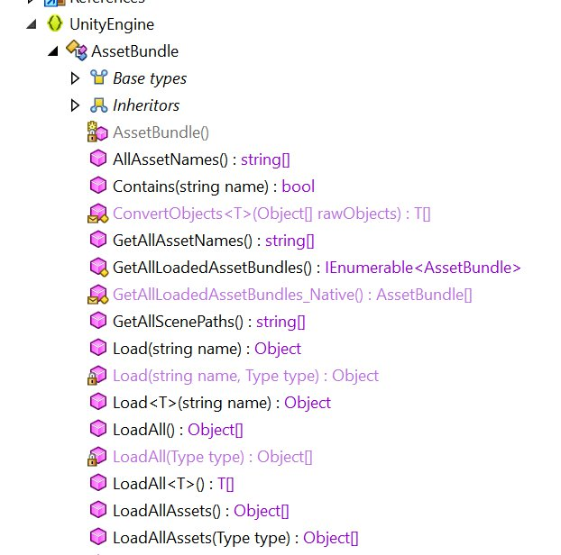

# 如何为游戏创建字库图 -- TMPro 篇

现在大部分 Unity 都采用了 TextMeshPro（以下简称 TMPro） 进行字体渲染。TMPro 是一种高精度的字库图（但不是矢量图）。

## TMPro 与汉化之间的关系

游戏显示文本主要有两种方式：基于 ttf/otf 等字体的显示；基于字库图的显示方式。

实际上字体文件渲染也是通过读取 ttf 的字体信息，之后利用 freetype 之类的东西实时计算出来对应的字库图，因此通过预生成要用到的字体的图片可以节省运行时的计算开销以及减少游戏体积（虽然在 2025 年的今天这些都不是事情，但是有些古早的游戏引擎可能懒得升级了，说的就是你，各大日厂 GalGame 游戏）

>  实际上 Unreal 主流的字体显示就是依靠 ttf/otf 字体实现的。
>
> 小知识：Unreal 内置了封包 Override，因此 name_P.pak 会覆盖 name.pak。在 _P.pak 里面替换掉 font 能解决 90% 的字库问题。

反观 Unity 这边，Unity 的字体显示有多种方法，这里仅列举两个实际遇到的：

- TextMeshPro（字库图）：

  原本是一个插件，后来被 Unity 官方吃掉后转正了，TextMeshPro 是字库图的一个变种，不同于方方正正的 MxN 方格排列的字库图，其通过特定算法排列文本，让单张 8192x8192 的字库图能塞下超过 10k 个字（实测汉化时候我们塞进去了中文+日文+[俄文，rus 项目] 接近 10k 字符，同时空间还绰绰有余（当然代价是字库图 font.bin 高达 192MiB）。

- TexMesh（字库图）：感觉已经被 TextMeshPro 替代了。本质上就是低配版 TextMeshPro。

  - 在游戏「人狼村之谜」中就是采用了这个方式渲染的。
  - 小插曲，「人狼村之谜」的某个汉化版本为了加密自己的汉化，采用了基于字体文件的加密方式，aka，通过修改字体文件，让「栗子」两个字实际显示的是「笨蛋」，通过这种方法，即使 dump 出来了游戏文本，也会因为缺乏码表对应关系而显示为乱码。
  - 对于这种加密，有两种方法：
    - 利用万能的 OCR，将文本中所有用到的字拿出来，再通过 pillow 之类的东西将字体对应的字画出来，丢给有道 OCR 或者 paddle ocr 之类的方式去识别。
    - web 那边也常见这种加密（例如起点，轻书架等），另一种做法是找到字体相对应的字形，之后直接计算字形相似度。
  - 实际上由于汉化组作者把用到的字体文件也打包进去了，导致有了可乘之机，如果从文件中删除 font 文件，单纯从 TextMesh 生成的 Texture 图基本上很难逆向了（除非自己实现一遍 TextMesh 的字库图查找算法）

由于 TMPro 往往只包含了作者用到的文本（不会有好心的霓虹/英文作者塞进去了一整个 7000 常用字表叭），因此，汉化 Unity 游戏，必不可少的会面对让人头大的 TMPro 问题。也就是说需要重建字库，否则就会遇到「口人是犯法的」。 

## 如何不用创建 TMPro

在大部分情况下，手工创建 TMPro 建立新字库都是一种很痛苦的事情，所以本章节先讲一下如何不用创建 TMPro 也能实现字库图重新导入。

> 希望大家都不用走到「如何创建 TMPro」这一步

实际上，广泛使用的 `XUnity.AutoTranslator` 就是一个很好的学习样例。https://github.com/bbepis/XUnity.AutoTranslator

`XUnity.AutoTranslator`（下称 XUA）的方法是：

1. 通过反射（mono/il2cpp）拿到 `AssetBundle.Load` 相关的函数。
2. 通过反射确定 TMPro 相关函数的位置。
3. 利用 `AssetBundle.Load` 加载位于文件系统上的外部封包。
4. 修改 TMPro 函数的内部变量，将原本的 TMPro 数据指向外部封包，例如：[arialuni_sdf_u2018，arialuni_sdf_u2019](https://github.com/bbepis/XUnity.AutoTranslator/releases/latest/download/TMP_Font_AssetBundles.zip)
5. 同时，修改 charset 等玩意。

因此通过这种方法实现了偷梁换柱，将外部提供的 TMPro 强制替换掉内部的 TMPro。

--------------------------------------

在大部分情况下这个方法都很好用，但是对于 TCAA 这个项目来说，最关键的一步却出了问题：

> 获得  `AssetBundle.Load` 函数

本游戏的打包是 `lz4` 类似的打包方式，因此游戏只会生成一个 data.unity3d 的 mono package 文件，所有的 sharedassets0，resource 文件等都在这个封包里面。因此通过 il2cppdumper 看到，游戏完全没有依赖 `UnityEngine.AssetBundle`（大概叫这个名，凭印象写的） 这个 dll。因此在导出表和各种地方都看不到相关的封包加载函数。这样就导致了虽然 XAU 能识别到 TMPro 相关的函数，但是却因为无法从文件系统加载和解析封包而罢工。

> 虽然但是，既然游戏能加载资源文件，那很有可能在 unityplayer 之类的 dll 里面也有加载函数，但是这玩意就不能很简单的用反射的方式拿到了。

------------------------

因此，如果想摆脱 XUA 的依赖自行实现字库图导入的话，可以仿照 XUA 写 hook 代码，自行实现一遍 XUA 的相关逻辑。

## 如何创建 TMPro

如果很不幸，你面临着和 TCAA 一样的窘迫处境，那么在这种极端情况下将无法使用基于 Hook 导入免 TMPro 方法。

>  或者你想 让补丁干净一些，不想依赖 bepinex 和 XUA。

因此，本章将讲述「古法手工匠心打造 TMPro」的方法， 以及操作过程中的一些 tricks。

## 创建 TMPro

## 导出 TMPro

## 导入 TMPro

## 测试

